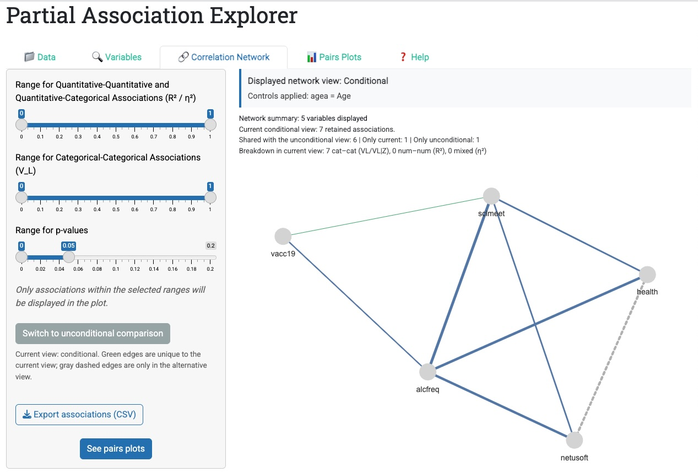
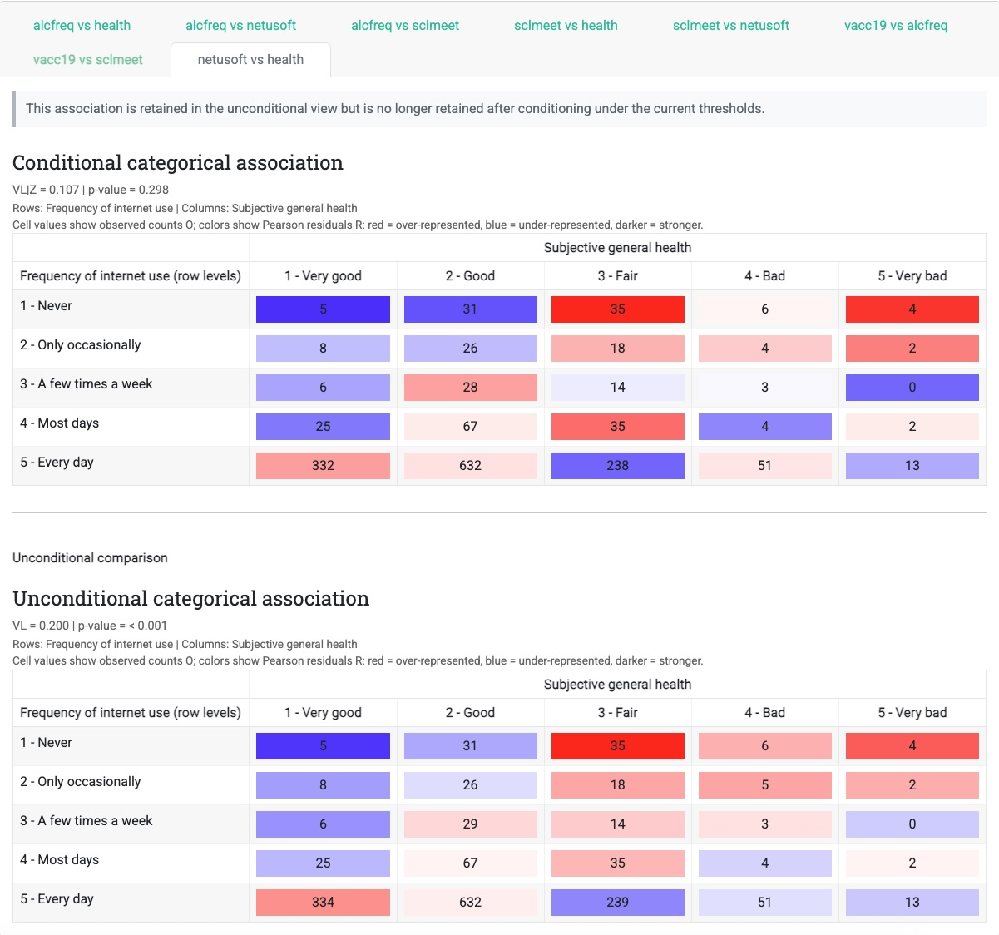

# Summary

`Partial Association Explorer` is an open-source R Shiny application for
exploring how variables are related in datasets that mix numerical and
categorical information [@r; @shiny]. It is intended for research settings in
which a simple correlation matrix is insufficient and background variables may
distort the patterns visible in the raw data. A user selects variables of
interest, optionally adds controls such as age, education, or region, and
compares the resulting marginal and adjusted association networks. Each edge
can be inspected through a pair plot adapted to the two variable types.

The application combines a global association measure, a significance test,
and local diagnostics for numerical--numerical, numerical--categorical, and
categorical--categorical pairs. Network and pair-plot views explicitly mark
associations that persist, disappear, or emerge after adjustment. The purpose
is exploratory rather than causal: the software helps researchers recognize
potential confounding or masking and decide where a more focused model is
warranted. The MIT-licensed software, a separately licensed example extract
adapted from European Social Survey data, and a reproducible case study are
available at <https://github.com/Thadhaeg/Partial-association-explorer>.

# Statement of need

Social-science, public-health, and survey datasets commonly combine continuous
measurements, ordered responses, nominal factors, and binary indicators.
Standard correlation displays cover only numerical variables, while
contingency-table summaries do not provide a uniform workflow for mixed pairs.
Moreover, marginal associations can be misleading when both variables depend
on a common background factor.

The central challenge is not simply to calculate associations or draw a
network. Researchers need to determine whether each visible link persists
under a plausible adjustment set, disappears after shared variation is
removed, or emerges when a masking relationship is resolved. For mixed data,
this normally requires separate correlation, analysis-of-variance, regression,
and categorical-data workflows whose outputs are difficult to compare
consistently.

`Partial Association Explorer` makes this contrast the organizing principle of
the analysis. A shared set of controls is applied across all pair types; the
network classifies links as retained, disappearing, or appearing; and matched
local diagnostics show why a network-level change occurred. The application
targets researchers screening multivariate data before formal modeling, as
well as students and non-specialists who need an interpretable bridge between
an association network and the models underlying its edges.

# State of the field

Existing tools address important parts of this problem. `corrplot`,
`ggcorrplot`, and `GGally` visualize numerical correlations and pairwise
distributions [@corrplot; @ggcorrplot; @ggally], while `ggstatsplot` adds
inferential summaries to individual graphics [@patil2021ggstatsplot]. `qgraph`
turns correlation and other statistical matrices into network displays
[@epskamp2012qgraph]. These tools are powerful for numerical or already
constructed matrices, but they do not provide one adjustment-and-comparison
workflow for mixed pair types.

For heterogeneous data, `Sirius` constructs mutual-information networks
[@adamsetal2021], and `mgm` estimates conditional-dependence networks through
mixed graphical models [@haslbeck2020mgm]. `PAsso` quantifies, tests, and
visualizes partial association for ordinal responses [@li2021passo]. These
methods answer complementary questions: joint graphical-model estimation and
ordinal partial association differ from applying a researcher-chosen control
set to every mixed-type pair and comparing the resulting marginal and adjusted
views.

`AssociationExplorer` provides an accessible Shiny workflow for marginal
mixed-type associations [@soetewey2026]. `Partial Association Explorer`
retains this emphasis on accessibility but changes the analytical object from a
single marginal network to a linked pair of marginal and adjusted results. This
required pair-type-specific adjusted models, shared complete-case and
control-matrix handling, and nested likelihood comparisons for categorical
outcomes.

# Software design

The application is a standalone Shiny program organized around data upload,
variable and control selection, an interactive `visNetwork` graph, and pair
plots [@visnetwork]. Numeric R columns enter the numerical branch; other
columns enter the categorical branch. Controls affect estimation but are not
drawn as network nodes. The same selected controls are applied to every pair,
making the marginal and adjusted views directly comparable.

The network exposes the comparison directly. In the adjusted view, blue edges
are retained in both analyses, green edges appear only after adjustment, and
gray dashed edges occur only in the marginal alternative. Effect size and
$p$-value filters are applied to the active view, while the alternative remains visible for comparison. Selecting an edge opens its matched local diagnostic.

{width="100%"}

| Pair type | Marginal analysis | Adjusted analysis | Local diagnostic |
|:--|:--|:--|:--|
| Numerical--numerical | Pearson $r$ and $t$-test | Partial $r$ from residuals and partial-correlation $t$-test | Scatter or added-variable plot |
| Numerical--categorical | $\eta^2$ and ANOVA $F$-test | Partial $\eta^2$ and extra-sum-of-squares $F$-test | Raw or residualized group means |
| Categorical--categorical | $V_L$ and likelihood-ratio $\chi^2$ test | $V_{L\mid Z}$ and conditional likelihood-ratio $\chi^2$ test | Counts colored by Pearson residuals |

The local views mirror the same comparison. Numerical pairs use a raw scatter
plot or an added-variable residual plot; mixed pairs compare raw group means
with means after residualizing the numerical outcome; and categorical pairs
compare observed tables whose colors encode Pearson residuals from the
relevant null model. Each adjusted diagnostic is displayed with its marginal
counterpart so that a changed edge can be interpreted at the observation or
cell level.

For categorical pairs, the app compares nested structured multinomial models.
With likelihood-ratio statistic $G^2=2(\ell_1-\ell_0)$ and complete-case sample size $n$, it reports

$$V_L=\sqrt{1-\exp(-G^2/n)}.$$

Without controls, this quantity is the sample analogue of Linfoot's
informational coefficient and has the Cox--Snell likelihood-ratio
pseudo-$R^2$ form [@linfoot1957; @coxsnell1989]. With controls $Z$, the null
model allows row and column categories to depend on $Z$, while the alternative
adds their interaction; the resulting $G^2_{\mid Z}$ defines $V_{L\mid Z}$.
This regression formulation avoids discretizing continuous controls into
sparse multiway tables [@agresti2013].

{width="100%"}

# Research impact statement

The general software was presented as a poster at Beamm.conf26 in Brussels in June 2026
[@dhaegeleer2026poster]. A separate full-length preprint applies the software to
a Belgian extract from European Social Survey Round 11 and documents the case
study summarized here [@dhaegeleer2026preprint]. The repository provides the
source code, variable descriptions, analysis-ready example extract, and inputs
needed to reproduce the accompanying figures [@ess2024data; @ess2024doc].

In the ESS case study, adjustment for age removes a marginal association
between internet-use frequency and self-rated health ($V_L=0.200$, $p<0.001$;
$V_{L\mid Z}=0.107$, $p=0.298$), while revealing an association between
social-meeting frequency and vaccination status ($V_L=0.085$, $p=0.074$;
$V_{L\mid Z}=0.105$, $p=0.0078$). This realized application demonstrates the
software's research purpose: distinguishing associations that are robust to
adjustment from those shaped by a plausible confounder. The software also
supports teaching and methodological demonstration of partial correlation,
ANCOVA, likelihood-ratio testing, conditional independence, and local
categorical residuals. It extends the peer-reviewed `AssociationExplorer`
workflow with a model-based conditional layer [@soetewey2026].

# AI usage disclosure

OpenAI Codex was used to assist with copy-editing and formatting the manuscript and documentation. All AI-assisted changes were reviewed, edited, and validated by the authors, who remain responsible for the accuracy and correctness of the final manuscript and software.

# Acknowledgements

The authors thank researchers from UCLouvain Saint-Louis Bruxelles involved in
the Beamm project for feedback on earlier software versions. Partial
Association Explorer builds on `AssociationExplorer`, whose development was
supported by the Walloon Region and Service public de Wallonie (SPW) Recherche
through the ODALON project (Win2Wal 2023, no. 2310019, ODALON3). Partial
Association Explorer received no specific project funding.

# References
